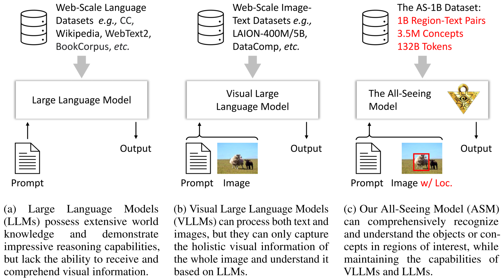
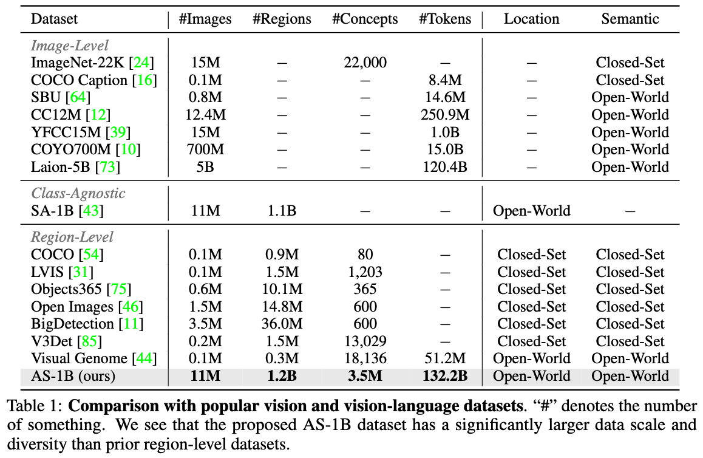
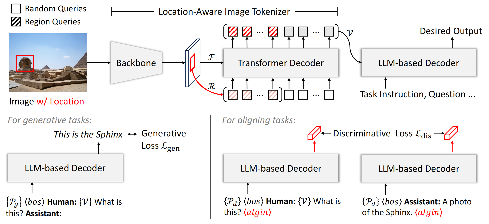

# The All-Seeing Project  [[Paper](https://arxiv.org/abs/2308.01907)][[All-Seeing Model Demo](https://openxlab.org.cn/apps/detail/wangweiyun/All-Seeing-Model-Demo)][[AS-1B Dataset Browser](https://openxlab.org.cn/apps/detail/wangweiyun/All-Seeing-Dataset-Browser)]

This is the official implementation of the paper "The All-Seeing Project: Towards Panoptic Visual Recognition and Understanding of the Open World". (The name "All-Seeing" is derived from "The All-Seeing Eye", which means having complete knowledge, awareness, or insight into all aspects of existence. The logo is Millennium Puzzle, an artifact from the manga "Yu-Gi-Oh!")

## News and Updates
- `Aug 29, 2023`: 🚀 [**All-Seeing Model Demo**](https://openxlab.org.cn/apps/detail/wangweiyun/All-Seeing-Model-Demo) and [**Dataset Browser**](https://openxlab.org.cn/apps/detail/wangweiyun/All-Seeing-Dataset-Browser) are available on the OpenXLab now!

## Schedule
- [ ] Release the ASM model.
- [ ] Release the human verification results of AS-1B.
- [ ] Release the detailed region annotations of AS-1B.
- [ ] Release the semantic tags of AS-1B.
- [x] Online demo, including dataset browser and ASM online demo.

## Introduction 
We present the All-Seeing Project with:

***All-Seeing 1B (AS-1B) dataset***: we propose a new large-scale dataset (AS-1B) for open-world panoptic visual recognition and understanding, using an economical semi-automatic data engine that combines the power of off-the-shelf vision/language models and human feedback.

***All-Seeing Model (ASM)***: we develop a unified vision-language foundation model (ASM) for open-world panoptic visual recognition and understanding. Aligning with LLMs, our ASM supports versatile image-text retrieval and generation tasks, demonstrating impressive zero-shot capability.




Figure 1: Overview and comparison of our All-Seeing project with other popular large foundation models.

## Online Demo
**All-Seeing Model demo** is available [here](https://openxlab.org.cn/apps/detail/wangweiyun/All-Seeing-Model-Demo).

**Dataset Browser** is available [here](https://openxlab.org.cn/apps/detail/wangweiyun/All-Seeing-Dataset-Browser).

<video id="video" controls="" preload="none" poster=""><source id="mp4" src="./assets/All-Seeing-Model-Demo.mp4" type="video/mp4"></videos>

## Dataset Overview
AS-1B with over 1 billion regions annotated with semantic tags, question-answering pairs, and detailed captions. It covers a wide range of 3.5 million common and rare concepts in the real world, and has 132.2 billion tokens that describe the concepts and their attributes.




Some examples


## Model Architecture

The All-Seeing model (ASM) is a unified framework for panoptic visual recognition and understanding, including image/region-text retrieval, image/region recognition, captioning, and question-answering.



## License

This project is released under the [Apache 2.0 license](LICENSE). 


<!-- ## 🖊️ Citation

If you find this project useful in your research, please consider cite:

```BibTeX
@misc{2023allseeing,
    title={The All-Seeing Project: Towards Panoptic Visual Recognition and Understanding of the Open World},
    author={Min Shi and Weiyun Wang and Qingyun Li and Wenhai Wang and Zhenhang Huang and Linjie Xing and Zhe Chen and Hao Li and Xizhou Zhu and Zhiguo Cao and Yushi Chen and Jifeng Dai and Yu Qiao},
    year={2023}
}
``` -->
