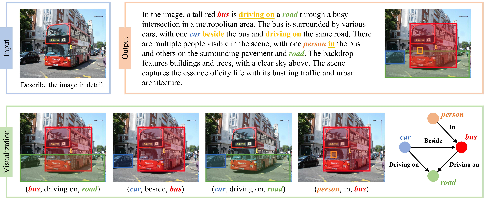

# The All-Seeing Project V2  [[Paper]()][[Model](https://huggingface.co/OpenGVLab/ASMv2)][[Dataset](https://huggingface.co/datasets/OpenGVLab/AS-V2)]

## Introduction 
We present the All-Seeing Project V2 with:

***[All-Seeing Dataset V2 (AS-V2) dataset](https://huggingface.co/datasets/OpenGVLab/AS-V2)***: we propose a novel task, termed Relation Conversation (ReC), which unifies the formulation of text generation, object localization, and relation comprehension. Based on the unified formulation, we construct the AS-V2 dataset, which consists of 127K high-quality relation conversation samples, to unlock the ReC capability for Multi-modal Large Language Models (MLLMs).

***[All-Seeing Model v2 (ASMv2)](https://huggingface.co/OpenGVLab/ASMv2)***: we develop ASMv2, which integrates the Relation Conversation ability while maintaining powerful general capabilities.
It is endowed with grounding and referring capabilities, exhibiting state-of-the-art performance on region-level tasks.
Furthermore, this model can be naturally adapted to the Scene Graph Generation task in an open-ended manner.

***[Circular-based Relation Probing Evaluation (CRPE) benchmark](https://huggingface.co/datasets/OpenGVLab/CRPE)***: We construct a benchmark called Circular-based Relation Probing Evaluation (CRPE), which is the first benchmark that covers all elements of the relation triplets `(subject, predicate, object)`, providing a systematic platform for the evaluation of relation comprehension ability.


Figure 1: Overview and comparison of our All-Seeing Model v2 with other MLLMs.

## Dataset Overview

AS-V2 comprises 127K high-quality relation conversation samples in total, including 42K in detailed descriptions, 63K in region captioning, and 22K in conversations (~90K turns in total), respectively.

In the relation conversation, all mentioned objects are linked to their corresponding regions within the image while the predicates are linked to the regions corresponding to their subjects and objects.
Therefore, sentences in the relation conversation can be easily parsed into a scene graph.
Some data examples are shown below.


<!-- 
 -->

More specifically, each sentence in relation conversation marks the object and predicate in the sentence using `<ref></ref>` and `<pred></pred>`, respectively.
Each marked object is followed by a bounding box, indicating its localization. Similarly, each predicate is followed by two bounding boxes, which specifically refer to the subjects and objects of the predicate.

All bounding boxes are normalized to integer values within the range $[0, 1000)$ and formatted as:

$$\texttt{<box>[[}x_{1}^{1}, y_{1}^{1}, x_{2}^{1}, y_{2}^{1}\texttt{], ..., [}x_{1}^{n}, y_{1}^{n}, x_{2}^{n}, y_{2}^{n}\texttt{]]</box>},$$

where $\texttt{[}x_{1}^{i}, y_{1}^{i}, x_{2}^{i}, y_{2}^{i}\texttt{]}$ denotes the $i$-th bounding box linked to the object or predicate.

By utilizing the prediction of bounding boxes for each object (serving as semantic tags for nodes) and those for subjects and objects related to each predicate (serving as nodes, edges, and predicate labels), the generated ReC sentence can be naturally converted into a scene graph.

Some examples about the data formulation are shown below.


<!--  -->

Please refer to [our paper]() and [this script](scripts_asmv2/visualize_rec.py) for more details about the parsing of relation conversation.

## Benchmark Overview

CRPE is a benchmark designed to quantitatively evaluate the object recognition and relation comprehension ability of models.
The evaluation is formulated as single-choice questions.

The benchmark consists of four splits:
**Existence**, **Subject**, **Predicate**, and **Object**.

The **Existence** split evaluates the object recognition ability while the remaining splits are designed to evaluate the capability of relation comprehension, focusing on probing each of the elements in the relation triplets `(subject, predicate, object)` separately.
Some data examples are shown below.


Additionally, to evaluate the dependency on language priors, we also include abnormal data in our evaluation.
These images in these abnormal data depict relation triplets that are very rare in the real world.


## What can ASMv2 do?

<details>
<summary>Multimodal Dialogue with Grounded Relation (click to expand)</summary>

</details>

<details>
<summary>Multimodal Dialogue (click to expand)</summary>

<!--  -->

- Results on 12 general visual-language benchmarks.

    | **Model**                             | **VQAv2** | **GQA**        | **VisWiz**    | **SQA-IMG** | **TextVQA** | **POPE**      | **MME**         | **MMB**       | **$\text{MMB}_{CN}$** | **SEED**      | **LLaVA-Wild** | **MM-Vet**    |
    |---------------------------------------|---------------------|----------------|---------------|--------------------|:--------------------:|:---------------:|:-----------------:|:---------------:|:---------------------:|:---------------:|:----------------------:|:---------------:|
    | LLaVA-1.5-7B  | 78.5*               | 62.0*          | 50.0          | 66.8               | 58.2               | 85.9          | 1510.7          | 64.3          | 58.3                | 58.6          | 63.4                 | 30.5          |
    | LLaVA-1.5-13B | 80.0*               | 63.3*          | 53.6          | 71.6               | 61.3               | 85.9          | 1531.3          | 67.7          | 63.6                | 61.6          | 70.7                 | 35.4          |
    | VILA-7B            | 79.9*               | 62.3*          | 57.8          | 68.2               | 64.4               | 85.5          | 1533.0          | 68.9          | 61.7                | 61.1          | 69.7                 | 34.9          |
    | VILA-13B           | 80.8*               | 63.3*          | **60.6** | 73.7               | **66.6**      | 84.2          | 1570.1          | 70.3          | 64.3                | 62.8          | 73.0                 | 38.8          |
    | ASMv2 (ours)                          | **81.0**\*      | **63.9**\* | 58.1          | **87.1***     | 60.2               | **86.3** | **1621.0** | **74.4** | **64.3**       | **66.3** | **78.9**        | **41.3** |

</details>

<details>
<summary>Multimodal Dialogue with Pointer Instructions (click to expand)</summary>

<!--  -->

- Accuracy scores on the Referring Expression Comprehension task.

    | **Model**                                            | **RefCOCO <br> Val**        | **RefCOCO <br> Test-A**        | **RefCOCO <br> Test-B**        | **RefCOCO+ <br> Val**       | **RefCOCO+ <br> Test-A**       | **RefCOCO+ <br> Test-B**       | **RefCOCOg <br> Val**       | **RefCOCOg <br> Test**       | **Avg.**           |
    |--------------------------------------------------|:----------------:|:----------------:|:----------------:|:----------------:|:----------------:|:----------------:|:----------------:|:----------------:|:----------------:|
    | Shikra-13B                 | 87.83          | 91.11          | 81.81          | 82.89          | 87.79          | 74.41          | 84.64          | 83.16          | 84.21          |
    | Qwen-VL-7B                  | 88.55          | 92.27          | 84.51          | 82.82          | 88.59          | 76.79          | 85.96          | 86.32          | 85.73          |
    | Ferret-13B                  | 89.48          | 92.41          | 84.36          | 82.81          | 88.14          | 75.17          | 85.83          | 86.34          | 85.57          |
    | ASMv2 (ours)                                     | **90.56** | **94.24** | **86.24** | **84.81** | **90.83** | **76.89** | **87.52** | **88.26** | **87.42** |

<!--  -->

- Results on the Region Captioning task.

    | **Model**                           | **VG**           |             | **RefCOCOg**     |       |
    |-------------------------------------|:------------------:|:-------------------:|:------------------:|:-------------------:|
    |                                     | METEOR           | CIDEr             | METEOR           | CIDEr             |
    | GRiT              | 17.1             | 142.0             | 15.2             | 71.6              |
    | Kosmos-2     | -                | -                 | 14.1             | 62.3              |
    | GPT4RoI-7B  | 17.4             | 145.2             | -                | -                 |
    | GPT4RoI-13B | 17.6             | 146.8             | -                | -                 |
    | ASM-FT     | **18.3**    | 148.7 | **21.8**    | 107.8 |
    | ASMv2 (ours)                        | 17.9 | **153.5**    | 21.7 | **114.7**    |

<!--  -->

- Results on Visual Commonsense Reasoning.

    | **Method**                          | **Q $\rightarrow$ A** | **QA $\rightarrow$ R**               | **Q $\rightarrow$ AR**               |
    |:-----------------------------------|:------------------------:|:------------------:|:------------------:|
    | ViLBERT        | 72.4                     | 74.5               | 54.0               |
    | Unicoder-VL   | 72.6                     | 74.5               | 54.5               |
    | VLBERT         | 75.5                     | 77.9               | 58.9               |
    | ERNIE-ViL-L      | 78.5                     | 83.4               | 65.8               |
    | VILLA           | 78.5                     | 82.6               | 65.2               |
    | *GPT4RoI-7B | 87.4                     | 89.6               | 78.6               |
    | ASMv2 (ours)                        | 87.8                     | 88.8               | 78.4               |
    | *ASMv2 (ours)                       | **88.4**            | **89.9**      | **79.4**      |

- Accuracy scores on CRPE.

    | **Model**                | **Exist.** | **Subj.** | **Pred.** | **Obj.** | **Overall** |
    |:---------------------------------|:-------------------:|:------------------:|:------------------:|:-----------------:|:--------------------:|
    | Qwen-VL      | 76.34               | 19.47              | 26.99              | 35.36             | 27.27                |
    | LLaVA-1.5  | 84.90               | 37.86              | 43.68              | 47.89             | 43.14                |
    | ASMv2 (ours)                      | 87.24      | 50.55     | 48.46     | 57.10    | 52.04       |

</details>

<details>
<summary>Open-ended Scene Graph Generation (click to expand)</summary>

<!--  -->

- Recall scores on PSG.

    | **Model**                                            | **\#Tuples**              | **Recall**                | **mRecall**               |
    |:----------------------------------------------------|-------------------------:|-------------------------:|-------------------------:|
    | IMP            | 20.0 | 16.5 | 6.5  |
    | MOTIFS | 20.0 | 20.0 | 9.1  |
    | VCTree    | 20.0 | 20.6 | 9.7  |
    | GPSNet     | 20.0 | 17.8 | 7.0  |
    | PSGFormer    | 20.0 | 18.6 | 16.7 |
    | TextPSG                       | 50.0                      | 4.8                       | -                         |
    | TextPSG                           | 100.0                     | 5.5                       | -                         |
    | ASMv2 (ours)                                         | 9.2                       | 14.2                      | 10.3                      |

<!--  -->

</details>


## Training

We mainly use the LLaVA codebase to deveop ASMv2. Thanks for this great work. Here we present a brief introduction. In most cases, you will only need to refer to the new documentation that we have added. Please refer to the [original documentation](README_llava.md) of LLaVA 1.5 for more detailed manual.

The training process of ASMv2 is divided into two stages, with each stage comprising a pre-training phase and an instruction-tuning phase. 

### Stage1-Pretraining
In this phrase, we utilize the [pretraining data](https://huggingface.co/datasets/liuhaotian/LLaVA-Pretrain) filtered by LLaVA for training.

```shell
# stage1 pretrain
sh scripts_asmv2/stage1-pretrain.sh
```

### Stage1-Finetuning
We utilize the same instruction tuning data as [LLaVA 1.5](https://github.com/haotian-liu/LLaVA?tab=readme-ov-file#visual-instruction-tuning) in stage 1 while updating the format of region data into the format of ASMv2. The updated annotation is presented [here](https://huggingface.co/datasets/OpenGVLab/AS-V2/blob/main/llava_v1_5_mix665k_asmv2_format.json).

```shell
# stage2 finetune
sh scripts_asmv2/stage1-finetune.sh
```

### Stage2-Pretraining
We employ [5M filtered samples](https://storage.googleapis.com/sfr-vision-language-research/BLIP/datasets/ccs_filtered.json) from CC12M, [10M filtered samples](https://huggingface.co/datasets/OpenGVLab/AS-V2/blob/main/as_pretrain_10m.json) from AS-1B, and 15M filtered samples from [GRiT](https://huggingface.co/datasets/zzliang/GRIT) for pretraining.

You may download our pretrained checkpoint [here](https://huggingface.co/OpenGVLab/ASMv2-Pretrain) and use it for the subsequent instruction tuning.

```shell
# stage1 pretrain
sh scripts_asmv2/stage2-pretrain.sh
```

### Stage2-Finetuning
We extend the instruction tuning data of LLaVA 1.5 with our AS-V2 and other region-level multi-modal corpora, such as [AS-Core](https://huggingface.co/datasets/OpenGVLab/AS-Core). Please download the annotation [as_mix_4m.json](https://huggingface.co/datasets/OpenGVLab/AS-V2/blob/main/as_mix_4m.json), and the images from constituting datasets:

- COCO: [train2017](http://images.cocodataset.org/zips/train2017.zip), [train2014](http://images.cocodataset.org/zips/train2014.zip)
- GQA: [images](https://downloads.cs.stanford.edu/nlp/data/gqa/images.zip)
- OCR-VQA: [download script](https://drive.google.com/drive/folders/1_GYPY5UkUy7HIcR0zq3ZCFgeZN7BAfm_?usp=sharing), **we save all files as `.jpg`**
- TextVQA: [train_val_images](https://dl.fbaipublicfiles.com/textvqa/images/train_val_images.zip)
- VisualGenome: [part1](https://cs.stanford.edu/people/rak248/VG_100K_2/images.zip), [part2](https://cs.stanford.edu/people/rak248/VG_100K_2/images2.zip)
- LLaVAR: [images](https://huggingface.co/datasets/SALT-NLP/LLaVAR/resolve/main/finetune.zip)
- ShareGPT4V-100K: [WebData](https://drive.google.com/drive/folders/1tCUQ-sq6vdshZVkF0ZeF3K4eztkXJgax?usp=sharing), [SAM](https://drive.google.com/file/d/1dKumdOKSXtV7lIXdrG7jsIK_z2vZv2gs/view?usp=drive_link)
- CLEVR: [images](https://dl.fbaipublicfiles.com/clevr/CLEVR_v1.0.zip)
- ScienceQA: [images](https://scienceqa.github.io/#download)
- ST-VQA: [images](https://rrc.cvc.uab.es/?ch=11&com=downloads)
- DocVQA: [images](https://datasets.cvc.uab.es/rrc/DocVQA/train.tar.gz)
- Visual7W: [images](http://vision.stanford.edu/yukezhu/visual7w_images.zip)
- Flickr30K: [images](https://hockenmaier.cs.illinois.edu/DenotationGraph/)
- VCR: [images](https://visualcommonsense.com/download/)
- SA-1B: [images](https://ai.meta.com/datasets/segment-anything/)

After downloading all of them, organize the data as follows in `./playground/data`,

```
├── coco
│   ├── train2014
│   └── train2017
├── coco_flip
│   ├── train2014
├── gqa
│   └── images
├── ocr_vqa
│   └── images
├── textvqa
│   └── train_images
└── vg
│   ├── VG_100K
│   └── VG_100K_2
├── LLaVAR
│   └── images
├── CLEVR_v1.0
│   └── images
├── ST-VQA
│   ├── coco-text
│   ├── ...
│   └── vizwiz
├── DocVQA
│   └── documents
├── web-celebrity
│   └── images
├── web-landmark
│   └── images
├── wikiart
│   └── images
├── Visual7W
│   └── images
├── flickr30k
│   └── images
├── VCR
│   ├── lsmdc_0001_American_Beauty
│   └── ...
├── sam
│   ├── sa_000000
│   ├── ...
│   ├── sa_000063
│   └── images
```

Note that `sam/sa_0000xx` contains the images used by AS-Core while `sam/images` contains those used by ShareGPT4V-100K.

Besides, images in the `coco_flip` are the flipped version of those in the `coco`. We utilize flip augmentation for grounding data (i.e., refcoco, refcoco+, and refcocog). To generate these flipped images, please refer to the [script](scripts_asmv2/flip_image.py).

```shell
# stage2 finetune
sh scripts_asmv2/stage2-finetune.sh
```

## Testing

The method for testing the model remains the same as LLaVA-1.5; you just need to change the path of the script. Our scripts are located in `scripts_asmv2/`.

For evaluation of our proposed [CRPE](https://huggingface.co/datasets/OpenGVLab/CRPE) benchmark and other region-level tasks, please download the [evaluation data](https://huggingface.co/datasets/OpenGVLab/Region-Evaluation-Data/tree/main) and put them in `./playground/data/eval` as the following structure.

Note that all of the box coordinates in these files are for the image after [square pad](llava/train/train.py#L757).

```
├── crpe
│   ├── crpe_exist.jsonl
│   └── crpe_relation.jsonl
├── VCR
│   └── VCR_val_square_pad.jsonl
├── grounding
│   └── grounding_eval.jsonl
├── region_caption
│   ├── refcocog_val_coco_format.json
│   ├── refcocog_test_coco_format.json
│   ├── vg_test_coco_format.json
│   └── region_caption_eval_square_pad.jsonl
├── psg
│   └── psg_eval.jsonl
└── psg_pred_cls
    ├── psg_pred_cls_full_square_pad.jsonl
    └── psg_pred_cls_options.json
```

- Referring Expression Comprehension

```shell
sh scripts_asmv2/eval/grounding.sh OpenGVLab/ASMv2
```

- Region Captioning

```shell
sh scripts_asmv2/eval/region_caption.sh OpenGVLab/ASMv2
```

- Referring Question Answering

```shell
sh scripts_asmv2/eval/vcr.sh OpenGVLab/ASMv2
```

- Open-ended Scene Graph Generation

```shell
sh scripts_asmv2/eval/psg.sh OpenGVLab/ASMv2
```

- Predicate Classification

```shell
sh scripts_asmv2/eval/psg_pred_cls.sh OpenGVLab/ASMv2
```
